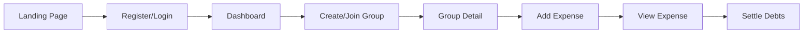

# Webapp Analysis: Splitifyd

## Executive Summary

This document provides a comprehensive analysis of the current Splitifyd webapp architecture, user flows, pain points, and migration recommendations for transitioning from vanilla JavaScript/TypeScript to Preact.

## Current Architecture

### Technology Stack
- **Build System**: esbuild with manual HTML templating
- **Language**: TypeScript (strict mode)
- **Framework**: None - vanilla JavaScript with direct DOM manipulation
- **State Management**: Scattered across modules, no central store
- **Styling**: CSS files with component-specific styles
- **Dependencies**: 
  - GSAP (animations)
  - Three.js (3D globe on landing page)
  - ScrollReveal (scroll animations)

### File Structure
```
webapp/
├── src/
│   ├── css/           # Stylesheets
│   ├── js/            # TypeScript source files
│   ├── public/        # Static assets (images, icons)
│   └── *.html         # HTML templates (13 pages)
└── dist/              # Build output
```

## User Flows

### 1. Primary User Journey



### 2. Authentication Flow

**Pages**: 
- `/` (Landing) → `/register.html` → `/dashboard.html`
- `/` (Landing) → `/login.html` → `/dashboard.html`
- `/reset-password.html` (Password recovery)

**Key Features**:
- Firebase Authentication integration
- Token-based session management
- Auto-redirect to dashboard if authenticated
- Email verification flow

### 3. Group Management Flow

**Pages**:
- `/dashboard.html` - List all user groups
- `/group-detail.html?id=X` - View specific group
- `/join-group.html?shareCode=X` - Join via share link

**Key Features**:
- Create new groups from dashboard
- View group members and balances
- Share groups via invite links
- Real-time balance updates

### 4. Expense Management Flow

**Pages**:
- `/add-expense.html?groupId=X` - Add new expense
- `/expense-detail.html?id=X` - View/edit expense
- `/group-detail.html` - List group expenses

**Key Features**:
- Split expenses equally or custom amounts
- Multi-payer support
- Edit/delete expenses
- Settlement recording

### 5. Static Pages

**Informational**:
- `/pricing.html` - Pricing information
- `/privacy-policy.html` - Privacy policy
- `/terms-of-service.html` - Terms of service
- `/cookies-policy.html` - Cookie policy

## Critical User Paths

These paths MUST work seamlessly during migration:

1. **New User Onboarding**
   - Landing → Register → Dashboard → Create First Group
   - Must maintain smooth animations and visual appeal

2. **Add Expense Flow**
   - Dashboard → Group → Add Expense → Save → View Balance
   - Core functionality - any breakage impacts user trust

3. **Group Sharing**
   - Share Link → Join Group → View Expenses
   - Social feature critical for app growth

4. **Authentication State**
   - Login persistence across page refreshes
   - Proper redirects for unauthenticated users
   - Token refresh handling

## Hidden Features & Edge Cases

### 1. URL Parameter Handling
- Groups and expenses use query parameters (`?id=X`)
- Join group uses share codes (`?shareCode=X`)
- Must maintain backward compatibility

### 2. Balance Calculations
- Real-time balance updates in group view
- Complex debt simplification algorithm
- "You owe" vs "Owed to you" summaries

### 3. Form Validation
- Custom validation for expense amounts
- Member email validation
- Duplicate expense prevention

### 4. Error States
- Network error handling with retry
- Invalid group/expense ID handling
- Expired share link messaging

### 5. Mobile Responsiveness
- Touch-friendly expense entry
- Responsive navigation
- Mobile-optimized modals

## Page Inventory

| Page | Purpose | Complexity | Dependencies |
|------|---------|------------|--------------|
| index.html | Landing page | High | Three.js, GSAP, ScrollReveal |
| login.html | User login | Low | Firebase Auth |
| register.html | User registration | Low | Firebase Auth |
| reset-password.html | Password recovery | Low | Firebase Auth |
| dashboard.html | Group list/overview | Medium | API calls, dynamic rendering |
| group-detail.html | Group expenses/balances | High | Real-time updates, complex UI |
| add-expense.html | Expense creation | High | Form validation, multi-step |
| expense-detail.html | View/edit expense | Medium | CRUD operations |
| join-group.html | Join via share link | Low | Share code validation |
| pricing.html | Static pricing info | Low | None |
| privacy-policy.html | Static legal text | Low | None |
| terms-of-service.html | Static legal text | Low | None |
| cookies-policy.html | Static legal text | Low | None |

## API Endpoints Used

Extracted from `webapp/src/js/api.ts`:

### Authentication
- `POST /api/register` - User registration
- `POST /api/login` - User login
- `POST /api/logout` - User logout
- `POST /api/resetPassword` - Password reset

### Groups
- `GET /api/groups` - List user's groups
- `POST /api/groups` - Create new group
- `GET /api/groups/:id` - Get group details
- `PUT /api/groups/:id` - Update group
- `DELETE /api/groups/:id` - Delete group
- `GET /api/groups/:id/balances` - Get group balances

### Expenses
- `GET /api/groups/:groupId/expenses` - List group expenses
- `POST /api/expenses` - Create expense
- `GET /api/expenses/:id` - Get expense details
- `PUT /api/expenses/:id` - Update expense
- `DELETE /api/expenses/:id` - Delete expense

### Sharing
- `POST /api/groups/:id/share` - Generate share link
- `POST /api/groups/join` - Join group via share code

### User
- `GET /api/user/profile` - Get user profile
- `PUT /api/user/profile` - Update profile

## Screenshots Documentation

Screenshots have been captured and stored in `/docs/screenshots/`. Key observations:

### Working Pages
1. **Landing Page** - Functional with purple theme, "App Screenshot Here" placeholder
2. **Login Page** - Clean login form with email/password fields
3. **Register Page** - Registration form with terms acceptance checkboxes
4. **Dashboard** - Shows groups list, but balance calculations show "$NaN" errors
5. **Group Detail** - Displays group info and expenses, but balances fail to load (spinner persists)

### Known Issues
1. **Reset Password Page** - Not working (http://127.0.0.1:6002/reset-password.html returns error)
2. **Balance Loading** - API endpoint `/groups/balances` returns 404 "Group not found" errors
3. **Balance Display** - Dashboard shows "$NaN" for balance amounts
4. **Group Balances** - Group detail page shows loading spinner indefinitely for balances

### API Error Details
From Firebase logs:
- Endpoint: `GET /groups/balances`
- Error: 404 NOT_FOUND - "Group not found"
- This affects balance calculations throughout the app

## Development Pain Points Discovered

1. **API Contract Mismatch** - Balance endpoint expects different URL structure
2. **Error Handling** - No user-friendly error messages when API calls fail
3. **Loading States** - Infinite spinners with no timeout or error display
4. **Type Safety** - "$NaN" suggests type coercion issues with balance data

## Dependencies Analysis

### Runtime Dependencies
1. **GSAP (v3.13.0)** - Animation library used on landing page
   - Used for scroll-triggered animations
   - ScrollTrigger plugin for parallax effects
   - **Preact Compatibility**: ✅ Can work with Preact but may need refactoring

2. **Three.js (v0.178.0)** - 3D graphics library
   - Powers the interactive globe on landing page
   - Heavy dependency (750KB+ minified)
   - **Preact Compatibility**: ✅ Can be integrated but consider lazy loading

3. **ScrollReveal (v4.0.9)** - Scroll animation library
   - Reveal animations on landing page
   - **Preact Compatibility**: ⚠️ DOM-based, will need Preact-specific approach

4. **chokidar-cli (v3.0.0)** - File watcher
   - Development dependency used in build process
   - Not shipped to production

### Build System
- **esbuild (v0.24.0)** - Fast JavaScript bundler
  - Custom configuration with entry point auto-discovery
  - ESM output format
  - No minification configured
  - HTML templating with CSP hash injection

### Development Tools
- **TypeScript (v5.7.2)** - Strict mode enabled
- **Jest (v30.0.4)** - Testing framework with jsdom
- **Husky (v9.1.7)** - Git hooks for quality checks
- **Lint-staged** - Run tests on commit

### Build Process Analysis
1. **Multi-step build**:
   - Clean dist directory
   - TypeScript type checking
   - Copy static assets (HTML, CSS, images)
   - Bundle JS with esbuild

2. **HTML Templating**:
   - Runtime API URL injection
   - CSP hash calculation for inline scripts
   - Manual file copying

3. **Development Experience**:
   - File watching with chokidar
   - No Hot Module Replacement (HMR)
   - Full page reloads on changes
   - Concurrent watchers for different file types

### Preact Migration Considerations

#### Compatible Libraries
- ✅ **GSAP** - Can be used with Preact hooks
- ✅ **Three.js** - Works well in Preact components
- ✅ **TypeScript** - Excellent Preact support

#### Libraries Needing Replacement
- ⚠️ **ScrollReveal** - Replace with Preact-friendly alternatives:
  - Intersection Observer API
  - Framer Motion
  - React Spring

#### Build System Changes Needed
1. **Replace esbuild config** with Vite or similar
2. **Add HMR support** for better DX
3. **Component-based bundling** instead of entry points
4. **Remove manual HTML templating**

### Bundle Size Analysis
Current production dependencies total:
- Three.js: ~750KB
- GSAP + ScrollTrigger: ~100KB
- ScrollReveal: ~15KB
- **Total**: ~865KB before app code

Recommendation: Lazy load Three.js only on landing page

### Shared Utilities to Preserve

The webapp has several utility modules that should be preserved during migration:

1. **Logger** (`utils/logger.ts`) - Structured logging system
2. **Safe DOM** (`utils/safe-dom.ts`) - Type-safe DOM element selection
3. **Auth Utils** (`utils/auth-utils.ts`) - Authentication helpers
4. **Form Validation** (`utils/form-validation.ts`) - Input validation
5. **UI Messages** (`utils/ui-messages.ts`) - User notifications
6. **UI Visibility** (`utils/ui-visibility.ts`) - Show/hide helpers
7. **Page Title** (`utils/page-title.ts`) - Dynamic title management

These utilities represent reusable business logic that can be adapted for Preact.

## Next Steps

1. ✅ **Phase 1 Complete**: User flows documented and screenshots captured
2. ✅ **Phase 2 Complete**: Dependencies analyzed and build system reviewed
3. **Phase 3**: Extract API contracts and types
4. **Phase 4**: Document pain points and performance metrics
5. **Phase 5**: Create migration priority order

---

*Last Updated: 2025-07-22*