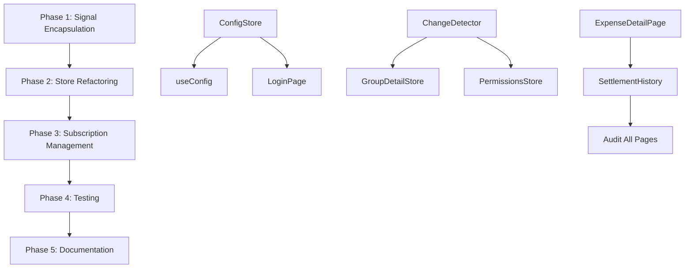

# Task: Refactor Real-time Stores for Robustness

## 1. Overview

An analysis of the web application's state management stores (`webapp-v2/src/app/stores`) was conducted, prompted by the recent successful refactoring of `comments-store.ts`. The goal was to identify other stores that manage real-time Firestore subscriptions and would benefit from the same robust, reference-counted subscription model.

The key improvements from the `comments-store` refactor were:
- **Proper Encapsulation**: Using private class members for signals.
- **Reference-Counted Subscriptions**: Allowing multiple components to safely share a single data subscription, which is only created on the first request and destroyed on the last.
- **Explicit State Machine**: Tracking the subscription lifecycle (`idle`, `subscribing`, `subscribed`) to prevent race conditions.

## 2. Current State Analysis

### ✅ Successfully Refactored
- **`comments-store.ts`**: Fully implements the reference-counting pattern with private signals and proper lifecycle management

### ❌ Critical Issues Identified

#### High Priority - Signal Encapsulation Violations
1. **`LoginPage.tsx`**: Module-level signals (emailSignal, passwordSignal, formDefaultsLoadedSignal)
2. **`useConfig.ts`**: Module-level signals (configSignal, loadingSignal, errorSignal)
3. **`RegisterPage.tsx`**: Already fixed - uses proper useState hooks

#### High Priority - Store Architecture Issues
1. **`group-detail-store-enhanced.ts`**: 
   - Assumes single group at a time (currentGroupId)
   - No reference counting for subscriptions
   - Would break with multiple group views

2. **`permissions-store.ts`**:
   - Single unsubscribe function
   - No reference counting
   - Memory leak: dispose() exists but not called by components

#### Medium Priority - Subscription Cleanup
1. **`ExpenseDetailPage`**: No cleanup in useEffect
2. **`SettlementHistory`**: Missing subscription disposal

## 3. Detailed Implementation Plan

### Phase 1: Critical Signal Encapsulation (IMMEDIATE - Day 1)

#### Step 1.1: Create ConfigStore Class
**File**: Create `webapp-v2/src/stores/config-store.ts`
```typescript
// Tasks:
- [ ] Create ConfigStore class with private signals
- [ ] Add readonly signal accessors
- [ ] Implement getConfig() method with caching
- [ ] Add error handling and retry logic
- [ ] Export singleton instance
```

#### Step 1.2: Refactor useConfig Hook
**File**: `webapp-v2/src/hooks/useConfig.ts`
```typescript
// Tasks:
- [ ] Import configStore from new ConfigStore
- [ ] Remove module-level signals
- [ ] Update hook to use configStore methods
- [ ] Maintain backward compatibility
- [ ] Test with existing consumers
```

#### Step 1.3: Fix LoginPage Signals
**File**: `webapp-v2/src/pages/LoginPage.tsx`
```typescript
// Tasks:
- [ ] Convert emailSignal to useState with sessionStorage
- [ ] Convert passwordSignal to useState with sessionStorage
- [ ] Convert formDefaultsLoadedSignal to useState
- [ ] Add proper cleanup in useEffect
- [ ] Test form persistence across navigation
```

### Phase 2: Store Refactoring (Days 2-3)

#### Step 2.1: Enhance ChangeDetector
**File**: `webapp-v2/src/utils/change-detector.ts`
```typescript
// Tasks:
- [ ] Add Map<resourceId, Set<callbacks>> structure
- [ ] Update subscribe() to handle resource-specific keys
- [ ] Enhance listener management for multiple resources
- [ ] Add resource-based reference counting
- [ ] Maintain backward compatibility
- [ ] Add comprehensive logging
```

#### Step 2.2: Refactor GroupDetailStore - Part 1 (Structure)
**File**: `webapp-v2/src/app/stores/group-detail-store-enhanced.ts`
```typescript
// Tasks:
- [ ] Add Map<groupId, SubscriptionState> for tracking
- [ ] Add Map<groupId, number> for reference counting
- [ ] Add Map<groupId, UnsubscribeFunctions> for cleanup
- [ ] Create SubscriptionState type enum
- [ ] Add private methods for subscription management
```

#### Step 2.3: Refactor GroupDetailStore - Part 2 (Implementation)
**File**: `webapp-v2/src/app/stores/group-detail-store-enhanced.ts`
```typescript
// Tasks:
- [ ] Implement registerComponent(groupId, userId)
- [ ] Implement deregisterComponent(groupId)
- [ ] Update subscribeToChanges to be resource-specific
- [ ] Update dispose() to handle multiple subscriptions
- [ ] Update refresh methods for specific groups
- [ ] Add transition state handling
```

#### Step 2.4: Refactor PermissionsStore - Part 1 (Structure)
**File**: `webapp-v2/src/stores/permissions-store.ts`
```typescript
// Tasks:
- [ ] Add Map<groupId, Unsubscribe> for multiple groups
- [ ] Add Map<groupId, number> for reference counting
- [ ] Add Map<groupId, Group> for caching
- [ ] Create subscription state tracking
```

#### Step 2.5: Refactor PermissionsStore - Part 2 (Implementation)
**File**: `webapp-v2/src/stores/permissions-store.ts`
```typescript
// Tasks:
- [ ] Replace subscribeToGroup with registerComponent
- [ ] Implement deregisterComponent(groupId)
- [ ] Update checkPermission for multiple groups
- [ ] Fix disposal logic for all subscriptions
- [ ] Add proper error handling
```

### Phase 3: Subscription Management Audit (Day 4)

#### Step 3.1: Fix ExpenseDetailPage
**File**: `webapp-v2/src/pages/ExpenseDetailPage.tsx`
```typescript
// Tasks:
- [ ] Identify store subscriptions in useEffect
- [ ] Add cleanup function to useEffect return
- [ ] Call appropriate dispose/deregister methods
- [ ] Test cleanup on navigation
```

#### Step 3.2: Fix SettlementHistory
**File**: `webapp-v2/src/pages/SettlementHistory.tsx`
```typescript
// Tasks:
- [ ] Audit subscription patterns
- [ ] Add proper cleanup logic
- [ ] Ensure parent cleanup is sufficient
- [ ] Add explicit disposal if needed
```

#### Step 3.3: Audit All Page Components
```typescript
// Tasks:
- [ ] List all pages using stores
- [ ] Check each for proper cleanup
- [ ] Document cleanup patterns
- [ ] Create checklist for future pages
```

#### Step 3.4: Hook PermissionsStore Cleanup
```typescript
// Tasks:
- [ ] Find all components using permissions-store
- [ ] Add dispose() calls in cleanup
- [ ] Test for memory leaks
- [ ] Verify permission updates work
```

### Phase 4: Testing & Validation (Day 5)

#### Step 4.1: Unit Tests - Reference Counting
```typescript
// Tasks:
- [ ] Test multiple registerComponent calls
- [ ] Test deregisterComponent reduces count
- [ ] Test last deregister cleans up
- [ ] Test re-registration after cleanup
- [ ] Test error scenarios
```

#### Step 4.2: Unit Tests - Subscription Lifecycle
```typescript
// Tasks:
- [ ] Test idle → subscribing → subscribed flow
- [ ] Test subscription disposal
- [ ] Test concurrent subscription attempts
- [ ] Test stale callback prevention
```

#### Step 4.3: E2E Tests - Navigation
```typescript
// Tasks:
- [ ] Create rapid navigation test
- [ ] Monitor Firebase listener count
- [ ] Check for accumulating subscriptions
- [ ] Verify data updates correctly
```

#### Step 4.4: Memory Leak Testing
```typescript
// Tasks:
- [ ] Create memory profiling test
- [ ] Navigate between pages 100 times
- [ ] Monitor heap usage
- [ ] Check for detached DOM nodes
- [ ] Verify listener cleanup
```

#### Step 4.5: Performance Benchmarks
```typescript
// Tasks:
- [ ] Measure subscription creation time
- [ ] Measure disposal time
- [ ] Compare before/after refactor
- [ ] Document performance gains
```

### Phase 5: Documentation & Best Practices

#### Step 5.1: Create Subscription Management Guide
```markdown
// Tasks:
- [ ] Document the reference-counting pattern
- [ ] Provide code examples
- [ ] Explain lifecycle states
- [ ] Show common pitfalls
```

#### Step 5.2: Add ESLint Rules
```typescript
// Tasks:
- [ ] Rule: No module-level signals
- [ ] Rule: Require cleanup in useEffect
- [ ] Rule: Dispose pattern enforcement
- [ ] Configure for webapp-v2 directory
```

## 4. Implementation Order & Dependencies



## 5. Success Metrics

### Immediate (After Phase 1)
- [ ] Zero module-level signals in LoginPage
- [ ] ConfigStore properly encapsulated
- [ ] All tests passing

### Short-term (After Phase 3)
- [ ] No Firebase listener accumulation
- [ ] All stores using reference counting
- [ ] Proper cleanup in all components

### Long-term (After Phase 5)
- [ ] 100% E2E test reliability
- [ ] Memory usage stable over time
- [ ] Clear documentation and patterns
- [ ] ESLint rules preventing regressions

## 6. Risk Mitigation

1. **Backward Compatibility**: Each change maintains existing API
2. **Progressive Rollout**: Test each phase before proceeding
3. **Rollback Plan**: Git commits after each successful phase
4. **Testing Coverage**: Unit and E2E tests for each change
5. **Pattern Validation**: Use working comments-store as template

## 7. Time Estimates

| Phase | Duration | Complexity | Risk |
|-------|----------|------------|------|
| Phase 1 | 1 day | Low | Low - Straightforward refactor |
| Phase 2 | 2 days | High | Medium - Core architecture change |
| Phase 3 | 1 day | Medium | Low - Adding cleanup calls |
| Phase 4 | 1 day | Medium | Low - Testing patterns exist |
| Phase 5 | 0.5 day | Low | Low - Documentation |

**Total: 5.5 days**

## 8. Notes & Considerations

1. **Priority**: Phase 1 is CRITICAL and should be done immediately
2. **Testing**: Each phase should have tests before moving forward
3. **Monitoring**: Watch Firebase console for listener counts
4. **Performance**: Profile before and after each phase
5. **Communication**: Update team on breaking changes

## 9. Appendix: Pattern Examples

### Reference-Counting Pattern (from comments-store)
```typescript
registerComponent(targetId: string): void {
    const currentCount = this.#subscriberCounts.get(targetId) || 0;
    this.#subscriberCounts.set(targetId, currentCount + 1);
    
    if (currentCount === 0) {
        // First subscriber - create subscription
        this.#subscribeToResource(targetId);
    }
}

deregisterComponent(targetId: string): void {
    const currentCount = this.#subscriberCounts.get(targetId) || 0;
    
    if (currentCount <= 1) {
        // Last subscriber - cleanup
        this.#subscriberCounts.delete(targetId);
        this.#dispose(targetId);
    } else {
        this.#subscriberCounts.set(targetId, currentCount - 1);
    }
}
```

### Proper Signal Encapsulation
```typescript
class Store {
    // Private signals
    readonly #dataSignal = signal<Data>(null);
    
    // Public readonly accessor
    get dataSignal(): ReadonlySignal<Data> {
        return this.#dataSignal;
    }
    
    // Controlled mutation through methods
    updateData(data: Data): void {
        this.#dataSignal.value = data;
    }
}
```

### Component Cleanup Pattern
```typescript
useEffect(() => {
    store.registerComponent(resourceId);
    
    return () => {
        store.deregisterComponent(resourceId);
    };
}, [resourceId]);
```