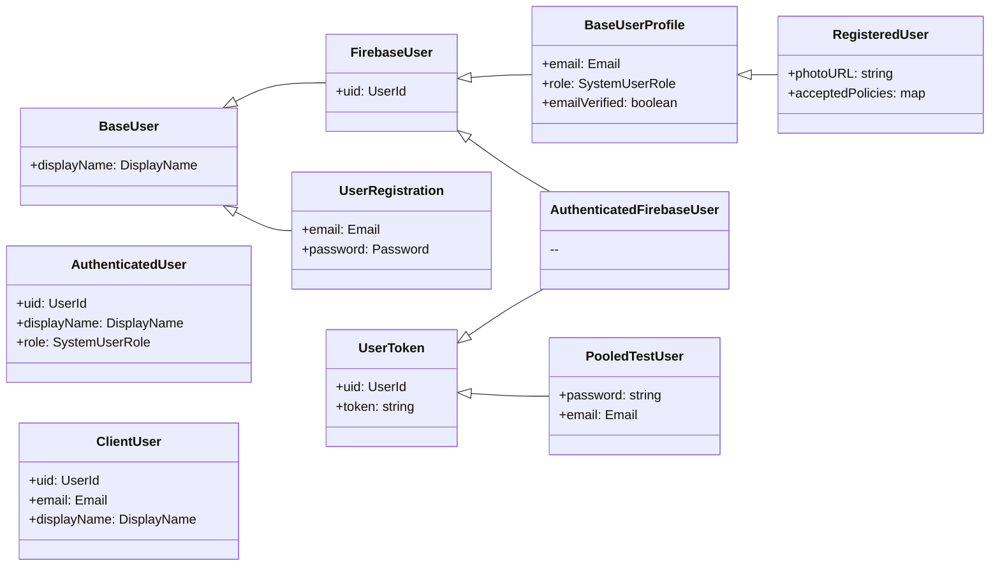

# Task: Refine and Document the User Type System

## Context

A previous cleanup effort (detailed in the old version of this document) successfully rationalized the user type hierarchy by introducing `BaseUserProfile` and removing dead code and fields.

While the current system is logically sound and separates concerns well (e.g., production vs. test, backend vs. frontend), an audit has revealed several areas for improvement. This task focuses on enhancing clarity, improving the developer experience, and creating canonical documentation to ensure the system is maintainable for the long term.

## Current State Analysis

The codebase contains eight distinct user-related types, each serving a specific purpose. The complexity is largely justified.

| Type | Purpose | Location |
| :--- | :--- | :--- |
| **`BaseUser`** | Root type: `displayName` only. | `shared-types.ts` |
| **`FirebaseUser`** | App's internal type for a Firebase-auth'd user (`uid`). | `shared-types.ts` |
| **`BaseUserProfile`** | Common profile fields (`email`, `role`). | `shared-types.ts` |
| **`RegisteredUser`** | The full, canonical user object for backend/API use. | `shared-types.ts` |
| **`UserRegistration`** | Payload for the user sign-up process. | `shared-types.ts` |
| **`AuthenticatedUser`** | Minimal, secure object for server-side auth context. | `shared-types.ts` |
| **`ClientUser`** | Frontend-safe subset of `RegisteredUser`. | `shared-types.ts` |
| **`Test Types`** | `UserToken`, `PooledTestUser`, `AuthenticatedFirebaseUser` used for testing infrastructure. | `shared-types.ts` |

## Goals

1.  **Eliminate Ambiguity:** Remove naming collisions that can lead to confusion and bugs.
2.  **Align Code and Documentation:** Ensure no "ghost" types exist in documentation that are not in the code.
3.  **Create a Single Source of Truth:** Establish a canonical guide for developers to understand the user type system.

---

## Action Plan

### Phase 3: Create a Canonical User Type Guide

**Problem:** Understanding the user type hierarchy requires reading the source code and having institutional knowledge. This is a barrier to new developers.

**Solution:**
1.  Create a new, dedicated documentation file at `docs/architecture/user-types.md`.
2.  Add a Mermaid.js diagram to this file to visually represent the type relationships.
3.  Add a clear reference table explaining the purpose of each type and when to use it.

**Mermaid Diagram to include in `user-types.md`:**

## Success Criteria

-   ✅ A new `docs/architecture/user-types.md` file exists and contains the visual diagram and reference guide.
-   ✅ The project compiles and all tests pass after these changes.